# Pizza Truck

Pizza Truck is an Order Management System for a pizza restaurant.
It runs on a mock terminal deployed to Heroku.

The purpose of this program is to manage the user ordering process from beginnng to end. It uses the input provided by the user to build the order and manipulate the data accordingly.

[Link to live site](https://pizza-truck.herokuapp.com/)

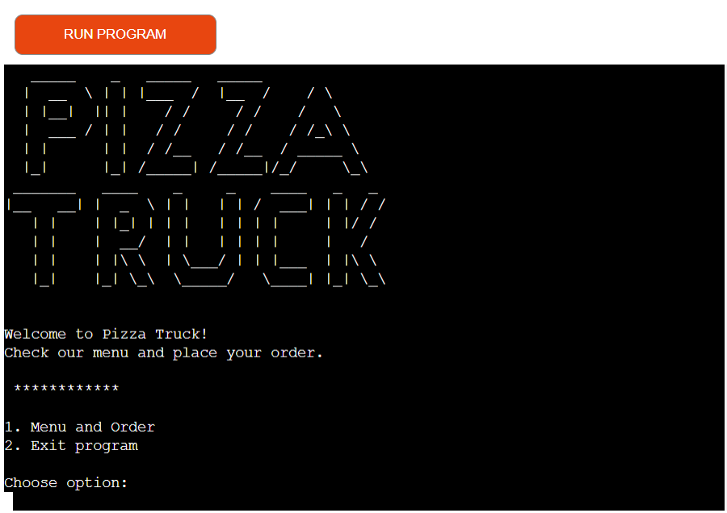

## Table of content

- [Design and User Experience](#design-and-user-experience)
  - [User Stories](#user-stories)
  - [Flow Chart](#flow-chart)

- [Features](#features)
  - [Validation](#input-validation)
  - [Case related options](#case-related-options)
  - [Pizzas menu](#pizzas-menu)
  - [Add pizza](#add-pizza)
  - [Make your own](#make-your-own)
  - [View current order](#view-current-order)
  - [Remove pizza](#remove-pizza)
  - [Place order](#place-order)

- [Testing](#testing)
  - [Tests](#tests)
  - [Validator Testing](#validator-testing)
  - [Fixed bugs](#fixed-bugs)
  - [Unfixed bugs](#unfixed-bugs)

- [Deployment](#deployment)
  - [Live Website](#live-website)
  - [Local Deployment](#local-deployment)

- [Credits](#credits)
  - [Code](#code)

- [Technologies used](#technologies-used)

- [Acknowledgements](#acknowledgements)

## Design and User Experience

### User Stories
- As a restaurant owner I want:
    - A system that helps me manage the orders.
    - That all the options on the menu are displayed to the users.
    - Users cannot order something that is not in the displayed options.
    - The order price is calclated correctly.

- As a user I want:
    - That the system is easy to use and provides clear instructions.
    - See all the available options.
    - Being able to personalize my order.
    - Being able to check and modify my order before placing it.
    - That the price is calculated correctly.

### Flow Chart

To develop a program that answers all the needs identified above, I have created the following flow chart:

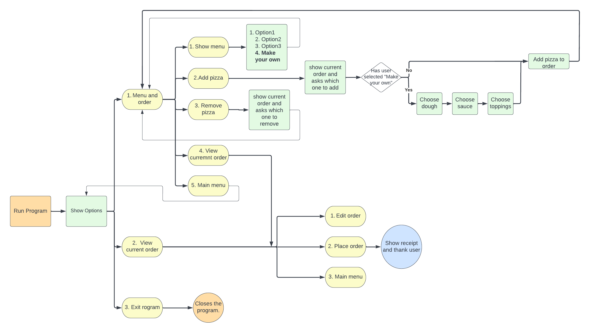

[Back to the top](#pizza-truck)

## Features 

When the program is launched the user is presented with the main menu. This menu works as landing page for the user that can decide if proceed, with the order or exit the program.

The program follows the same pattern at each stages:
1- provides information
2- presents choice of actions/options to the user
3- Receives the number corresponding to the user choice as input

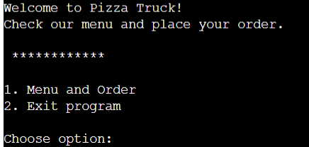

### Input validation

The user's input is validated to confirm that it corresponds to a valid option. All the inputs are validated through the same function, which accepts two parameters:
1- The value that needs to be validated, and
2- The array of options. This second parameter is passed to confirm if the value is in the range of valid options. 

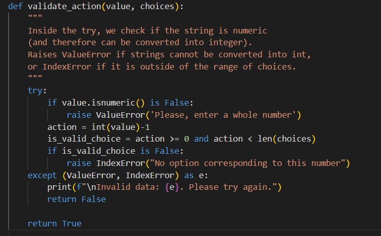

### Case related options

To make the user experience more enjoyable the program displays only the valid actions. This means that some options are hidden if they are not relevant. In particular, if there are no items in the basket, the option to view the order and to remove items will be hidden.

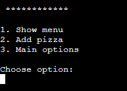 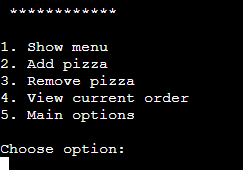

### Pizzas Menu

The pizzas are managed from a separate file, to keep them more maintainable.
We can add new pizzas creating new instances of the class "Pizza". They are then added to the pizza_menu list 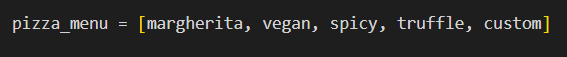

This way we can update the menu just in one place, and every time we need to display the available pizza we will display the correct and updated data.

### Add pizza

The user can add pizzas to the order by selecting the related option. It will show the available pizza by retrieving the data from the same pizza_menu list, so that the displayed option are automatically updated when the pizza menu is updated.

This time the options are displayed as a short list. The user can go back to the menu if they want to consult the ingredients and prices and update their order at any time.

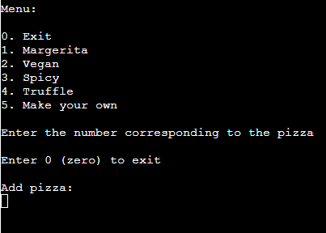

### Make your own

The user can create a custom pizza by selecting the option "Make your own".
The user will choose one option for the dough and one option for the sauce, from the available options.

For the toppings the user can choose up to 4 toppings.

For this reason the total of toppings is displayed to the user each time, so that they can see how many tippings they have left to select.

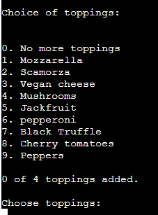

### View current order

If there is at least one item in the order, the seller can review the current order.
This option will display the added pizza, grouped by type, and the price total and subtotals.
This page displays the ingredients only for the custom pizzas, so that the user can see if they have made the wrong choice of ingredients and eventually delete the pizza and create it from scratch.

From this page the user can choose to edit the order, or to place it and exit the program

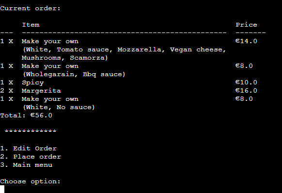

### Remove pizza

If the user added he wrong pizzas they have the option to remove them.

This option displays a short list of the pizzas currently in the order, grouped by type, and the total count for each type. The user just needs to select the option number corresponding to the pizza they want to remove.

The view is updated each time, so that the user can see which pizzas are left in the order.

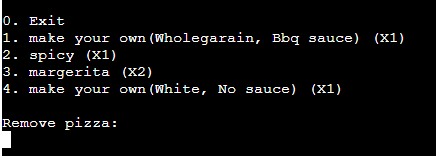

### Place order

When the user is ready to place the order they can click on the view order, to access the basket, and then select place order to finish.

This will display the final receipt with the total price and a confirmation that the order was made.

[Back to the top](#pizza-truck)

## Testing 

### Tests

  

  
Home page - General

  |Action | Expected behavious | Pass / Fail|
  |-------|--------------------|-------|
  |Action here | Expected behavious here | Pass |
  |Action here | Expected behavious here | Pass |
  |Action here | Expected behavious here | Pass |
  |Action here | Expected behavious here | Pass |
  |Action here | Expected behavious here | Pass |
  |Action here | Expected behavious here | Pass |
  |Action here | Expected behavious here | Pass |
  |Action here | Expected behavious here | Pass |

  

[Back to the top](#pizza-truck)

### Validator Testing

The PEP8 online website is not available at this point. For this reason I installed pycodestyle to my development environment (Visual Code studio), and fixed all the problems encountered during all stages of development.

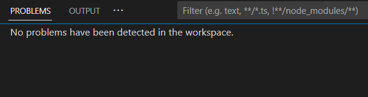

I also used the new Code Institute linter to validate the code, and it also has not detected any issue.

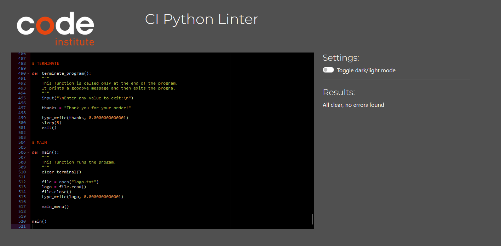

### Fixed Bugs

- __ValueError message not working.__ 

  While validating the user input I wanted to display two different messages, dependng on the issue found:
  1- Confirm if the user enter an integer (ValueError)
  2- Confirm if the integer corresponds to a valid action or if it is out of range (IndexError)
  The second check was raising the correct error message, but the ValueError was returning a different message, not allowing the user to understand why the input was invalid.
    

    
See bug screenshot

    
    

    

    To fix this error I split the checks in two different steps:
    1- Check if the user entered a numeric input, if not raise the ValueError
    2- If there is no ValueError we convert the input into integer, and we check if it is in range, if not we raise the IndexError
    

    
See fix screenshot

    
    

    

- __Remove_pizza removing more than 1 pizza at a time__ 

  When removing the pizza, if there were multiple pizza of the same type one after the other, the function was removing more than one at a time.
    

    
See bug screenshot

    
    

    

    To fix this bug I added a break keyword to remove only 1 item at a time
    

    
See fix screenshot

    
    

    

- __Show_current_order not showing custom pizzas__ 

  When printing the current order the custom pizzas added to the order were not displaying.
  This was caused by the fact the each custom pizza added to the order is a different object from the custom pizza in manu.
    

    
See bug screenshot

    
    

    

    To fix this bug I changed the list from where the pizza types are taken.
    First I create a new list with each type of pizza actually added to the order, then I count how many times each one of this pizzas appears in the order.

    This fix was showing the custom pizzas, although they were still separate objects, so custom pizzas with same ingredients were actually displayed separately.

    To improve this functionality I wanted to display custom pizzas with same ingredients in the same line. To accomplish this result I created a new list of dictionaries, one for each pizza in the order, and than counted their recurrency.
    

    
See improved fix screenshot

    
    

    

- __Choose_toppings counting invalid input__ 

  When choosing the toppings for the custom pizza there is a limit of 4 ingredients, but the function was increasing the count also when an invalid input was entered.
    

    
See bug screenshot

    
    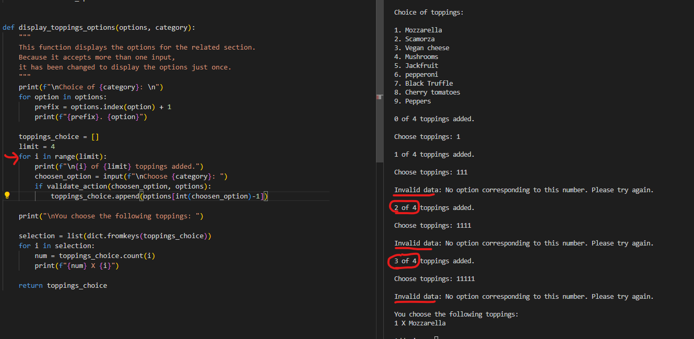

    

    To fix this bug I change the type of iteration, and choose a while loop.
    

    
See fix screenshot

    
    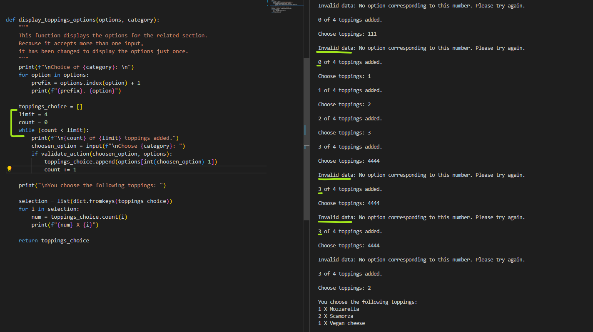

    

[Back to the top](#pizza-truck)

### Unfixed Bugs

- There are no known unfixed bugs.

## Deployment

### Live Website

The live version of this program is available on Heroku.

[Click here to open](https://pizza-truck.herokuapp.com/)

### Deployment on Heroku

  - To deply this project on Heroku I followed these steps:
    - Create an Heroku accoun
    - Click on Add App
    - Go to Settings > Config Vars
    - Add the config KEY and VALUE provided by Code Institute, in order to be able to use the template provided for this project
    - Click on add buildpack to add python and nodejs
    - Go to deploy tab
    - Select GitHub as deploy method
    - Select the relevant GitHub repository
    - Click on deploy branch

### Local Deployment
  - For a local deployment follow these steps:
    - Create a new directory on your machine, where you want do deploy the files
    - Open the existing repository in GitHub
    - Go to the "Code" tab
    - Click on the "Code" button
    - Copy the HTTPS link
    - Open your terminal and run the command __git clone 'link'__
    - use the link just copied, without quotes, instead of 'link'

[Back to the top](#pizza-truck)

## Credits 

### Code
- For this project I used the "Code Institute student template" required for deploying my third portfolio project (the Python command-line project). 

- The code to display the intro message as typewriter was taken from the [Learn Learn Scratch Tutorial](https://www.youtube.com/watch?v=2h8e0tXHfk0)

- The code to clear the terminal was taken from the following article on [Stackoverflow](https://stackoverflow.com/questions/2084508/clear-terminal-in-python)

## Technologies used

### Main languages

  - Python

### Python Libraries

  - sys
  - time
  - os
  - copy
  - tabulate

## Acknowledgements

A special thank to my mentor __Dick Vlaanderen__ for his precious feedback on this project.

[Back to the top](#pizza-truck)