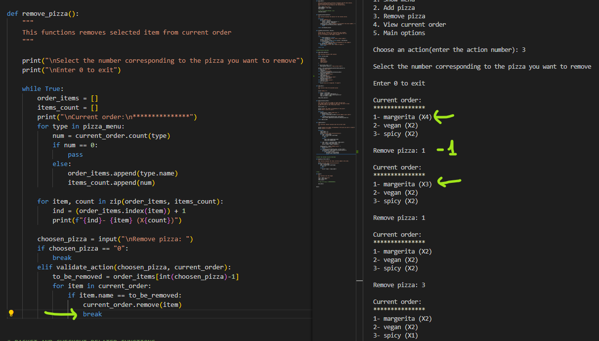

# Pizza Truck

Pizza Truck is an Order Management System for a pizza restaurant.

## Table of content

- [Design and User Experience](#design-and-user-experience)
  - [User Stories](#user-stories)
  - [Flow Chart](#flow-chart)

- [Features](#features)
  

- [Testing](#testing)
  - [Tests](#tests)
  - [Validator Testing](#validator-testing)
  - [Fixed bugs](#fixed-bugs)
  - [Unfixed bugs](#unfixed-bugs)
  - [Performance](#performance)

- [Deployment](#deployment)
  - [Live Website](#live-website)
  - [Local Deployment](#local-deployment)

- [Credits](#credits)
  - [Code](#code)
  - [Content](#content)

- [Technologies used](#technologies-used)

- [Acknowledgements](#acknowledgements)

## Design and User Experience

### User Stories
- As a restaurant owner I want that:
    - A system that helps me manage the orders.
    - All the options in the menu are displayed to the users.
    - Users cannot order something that is not in the displayed options.
    - The order price is calclated correctly.

- As a user I want:
    - That the system is easy to use and provides clear instructions.
    - See all the available options.
    - Being able to personalize my order.
    - Being able to check and modify my order before placing it.
    - That the price is calculated correctly.

### Flow Chart

To develop a program that answers all the needs identified above, I have created the following flow chart:

## Features 

## Testing 

### Tests

  

  
Home page - General

  |Action | Expected behavious | Pass / Fail|
  |-------|--------------------|-------|
  |Action here | Expected behavious here | Pass |
  |Action here | Expected behavious here | Pass |
  |Action here | Expected behavious here | Pass |
  |Action here | Expected behavious here | Pass |
  |Action here | Expected behavious here | Pass |
  |Action here | Expected behavious here | Pass |
  |Action here | Expected behavious here | Pass |
  |Action here | Expected behavious here | Pass |

  

### Validator Testing

### Fixed Bugs

- __ValueError message not working.__ 

  While validating the user input I wanted to display two different messages, dependng on the issue found:
  1- Confirm if the user enter an integer (ValueError)
  2- Confirm if the integer corresponds to a valid action or if it is out of range (IndexError)
  The second check was raising the correct error message, but the ValueError was returning a different message, not allowing the user to understand why the input was invalid.
    

    
See bug screenshot

    
    

    

    To fix this error I split the checks in two different steps:
    1- Check if the user entered a numeric input, if not raise the ValueError
    2- If there is no ValueError we convert the input into integer, and we check if it is in range, if not we raise the IndexError
    

    
See fix screenshot

    
    

    

- __Remove_pizza removing more than 1 pizza at a time__ 

  When removing the pizza, if there were multiple pizza of the same type one after the other, the function was removing more than one at a time.
    

    
See bug screenshot

    
    

    

    To fix this bug I added a break keyword to remove only 1 item at a time
    

    
See fix screenshot

    
    

    

- __Show_current_order not showing custom pizzas__ 

  When printing the current order the custom pizzas added to the order were not displaying.
  This was caused by the fact the each custom pizza added to the order is a different object from the custom pizza in manu.
    

    
See bug screenshot

    
    

    

    To fix this bug I changed the list from where the pizza types are taken.
    First I create a new list with each type of pizza actually added to the order, then I count how many times each one of this pizzas appears in the order.

    For the custom pizzas I also display the ingredients; because they are custom so it is useful to see how it is made.
    

    
See fix screenshot

    
    

    

    This fix was showing the custom pizzas, although they were still separate objects, so custom pizzas with same ingredients were actually displayed separately.

    To improve this functionality I wanted to display custom pizzas with same ingredients in the same line. To accomplish this result I created a new list of dictionaries, one for each pizza in the order, and than counted their recurrency.
    

    
See improved fix screenshot

    
    

    

### Unfixed Bugs

- There are no known unfixed bugs.

### Performance

## Deployment

### Live Website

### Local Deployment
  - For a local deployment follow these steps:
    - Create a new directory on your machine, where you want do deploy the files
    - Open the existing repository in GitHub
    - Go to the "Code" tab
    - Click on the "Code" button
    - Copy the HTTPS link
    - Open your terminal and run the command __git clone 'link'__
    - use the link just copied, without quotes, instead of 'link'

## Credits 

### Code
- For this project I used the "Code Institute student template" required for deploying my third portfolio project (the Python command-line project). 

- The code to display the intro message as typwriter was taken from the [Learn Learn Scratch Tutorial](https://www.youtube.com/watch?v=2h8e0tXHfk0)

### Content

## Technologies used

  - Python

## Acknowledgements

A special thank to my mentor __Dick Vlaanderen__ for his precious feedback on this project.